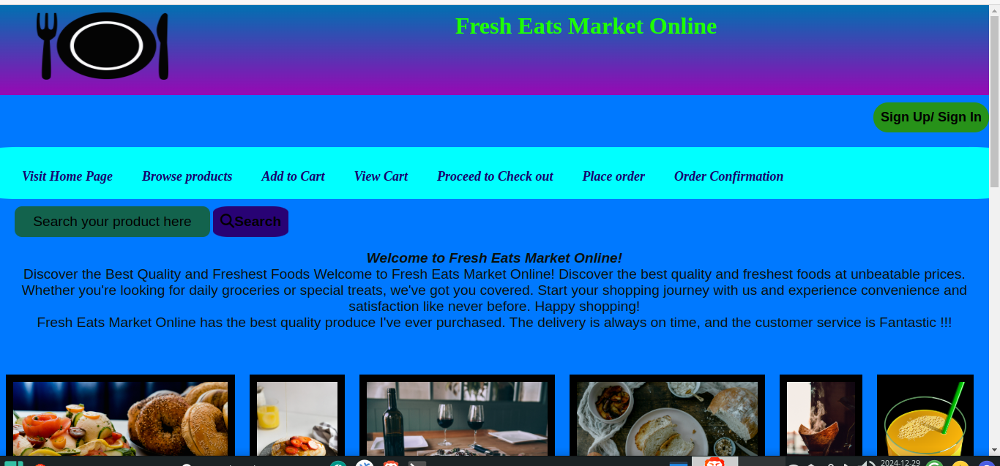
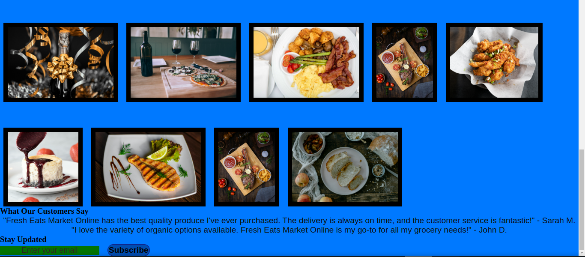

# Food-Ecommerce
Fresh Eats Market Online is a dynamic e-commerce platform dedicated to bringing the freshest and highest quality groceries directly to your doorstep. Our mission is to make healthy eating accessible and convenient by offering a wide variety of farm-fresh produce, organic products, and artisanal goods.

# Fresh Eats Market Online 🍏🍞🥦

**Fresh Eats Market Online** is a dynamic e-commerce platform dedicated to bringing the freshest and highest quality groceries directly to your doorstep. Our mission is to make healthy eating accessible and convenient by offering a wide variety of farm-fresh produce, organic products, and artisanal goods.

## Key Features
- **Wide Range of Products**: From fresh fruits and vegetables to dairy, meats, and pantry staples, we have everything you need for your kitchen.
- **Easy Shopping Experience**: User-friendly interface and intuitive navigation make it easy to find and purchase your favorite items.
- **Fast Delivery**: We ensure that your groceries are delivered promptly and in pristine condition, so you can enjoy the freshest products.
- **Sustainable Sourcing**: We partner with local farmers and suppliers to bring you products that are sustainably and ethically sourced.
- **Customer Loyalty Program**: Earn points with every purchase and enjoy exclusive discounts and offers.
- **Recipe Ideas and Cooking Tips**: Discover new recipes and cooking tips to make the most of your fresh ingredients.

## Screenshots

## Visit Us
[Visit Fresh Eats Market Online](https://Phali003.github.io/Food-Ecommerce)   // [https://phali003.github.io/Food-Ecommerce/]

